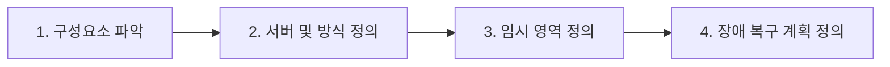

# 📂 03. 연계 메커니즘 및 데이터 수신 처리

> **데이터 형식, 전송 방식, 보안, 신뢰성을 종합적으로 고려하여 애플리케이션과 외부 모듈 간에 데이터를 안정적으로 교환하는 기술적 체계와 프로세스를 수립하는 단계입니다.**

---

## ⚙️ 1. 연계 메커니즘 정의 4단계 프로세스

연계 메커니즘을 안정적으로 구축하기 위해 송/수신 시스템의 인프라와 제약 조건을 분석하여 총 4단계의 설계를 진행합니다.



### 🔍 [1단계] 송/수신 시스템의 세부 구성요소 파악
연계 메커니즘을 정의하기 위해 송/수신 시스템 내부의 세부 기능과 중간 처리 장치들을 명확히 식별합니다.

* **송신 시스템 내부 구성**
  * ⚙️ **데이터 추출 프로그램:** `SQL`, `Batch`, `CDC` 등을 활용하여 운영 DB에서 연계 대상 데이터를 가공 및 추출
  * 📋 **로그 관리:** 데이터 추출 시점부터 전송 단계까지의 성공/실패 이력을 정밀하게 기록
  * 🚨 **에러 처리 로직:** 네트워크 단절 또는 타임아웃 발생 시 재전송 및 예외 상황 대응 규칙 적용
* **수신 시스템 내부 구성**
  * 🔄 **데이터 변환 로직:** 연계 서버로부터 넘어온 데이터를 수신 측 표준 규격(코드 매핑, 타입 변환)에 맞춤
  * 📥 **적재 프로그램:** 변환 완료된 데이터를 기반으로 운영 DB에 `Insert`, `Update`, `Delete` 명령 수행
  * ⚠️ **에러 및 재처리 로직:** 변환 및 DB 적재 실패 시, 해당 데이터를 격리 보관하고 재처리 유도
  * 💾 **운영 DB Table:** 모든 데이터 정제와 유효성 검증을 거친 최종 데이터가 보관되는 수신 측 실제 업무 테이블

---

### 🌐 [2단계] 연계 서버 및 연계 방식 정의
송/수신 시스템 사이에서 데이터 포맷, 통신 프로토콜, 보안 정책의 차이를 완화해주는 중계자(미들웨어)와 통신 구조를 정의합니다.

#### 🛠️ 연계 서버 및 어댑터의 4대 주요 기능
1. **데이터/프로토콜 변환:** 이기종 간 포맷 교환 (`JSON ──> XML`) 및 프로토콜 변환 (`REST ──> FTP`)
2. **메시지 라우팅:** 데이터의 헤더를 분석하여 정확한 목적지 수신 시스템을 찾아 안전하게 전송
3. **보안 제어:** 데이터 전송 구간 암/복호화, API 접근을 위한 인증/인가 및 접근 제어
4. **오류 관리 & 재처리:** 전송 실패 시 세션을 유지하고 실패 데이터만 선별하여 재전송 수행

#### 🎯 비즈니스 요구사항별 연계 방식 선택 기준
* **실시간 처리 필요 시:** `REST API`, `Socket`, `Event-Driven (Webhooks, Kafka)` 방식 채택
* **대용량 / 비실시간 처리 필요 시:** 배치 파일 전송(`FTP/SFTP`), `DB Link`, `DB Connection` 방식 채택

---

### 📦 [3단계] 인터페이스 테이블 및 임시 영역 정의
* **도입 목적:** 송/수신 시스템 간의 데이터 구조(스키마) 차이와 전송/데이터 생성 주기 격차를 완화하기 위한 버퍼(Buffer) 구역입니다.
* **핵심 기능:** 최종 운영 DB에 바로 반영하지 않고 임시 영역에 저장함으로써 데이터 유효성 검증, 결함 정제 및 가공 처리를 안전하게 진행합니다.

---

### 🚨 [4단계] 로깅 및 장애 복구 계획 정의
* **로그(Log) 기록의 활용 목적:** 실시간 연계 현황 모니터링, 서비스 수준 계약(`SLA`) 준수 검증, 보안 감사 대응, 장애 발생 시 원인 추적성 확보
* **재처리 메커니즘:** 데이터 전송 또는 삭제 실패 시 시스템이 중단되지 않도록, 실패한 데이터 건만 선별하여 다시 전송할 수 있는 자동/수동 재처리 관리 체계를 구축합니다.

---

## 💾 2. 데이터 추출 및 운영 DB 반영 절차

### 💡 데이터 생성 및 추출 시 핵심 고려사항
* 🥇 **데이터 품질:** 원천 데이터 추출 단계부터 데이터의 누락, 왜곡, 중복 발생을 원천 차단
* ⚡ **성능 최적화:** 원천 DB 부하를 축소하기 위해 배치 처리 주기, 추출 데이터 범위 및 인덱스 조건을 최적화 설계
* 🔒 **운영 안정성:** 철저한 로깅 기반 위에 중복 전송 방지(Idempotency) 로직 및 예외 처리 구문 탑재

---

### 📥 운영 DB 반영 4단계 프로세스

수신된 연계 데이터가 최종 업무 테이블에 반영되기까지 데이터 무결성을 보장하는 검증 및 트랜잭션 절차를 밟습니다.

```markdown
1. [수신 및 임시 저장]  ──> 연계 서버가 수신한 데이터를 I/F 테이블이나 임시 파일 영역에 저장
         ▼
2. [정합성 및 규칙 검증] ──> 데이터 타입 정합성, 무결성 검사 및 업무 규칙(Business Rule) 유효성 체크
         ▼
3. [운영 테이블 반영]   ──> 변경 구분 코드(Insert, Update, Delete)를 식별하여 최종 운영 DB에 매핑
         ▼
4. [트랜잭션 처리 완료] ──> 데이터 일관성 유지를 위해 반영 완료 후 최종 커밋(Commit) 또는 롤백(Rollback) 처리
```

